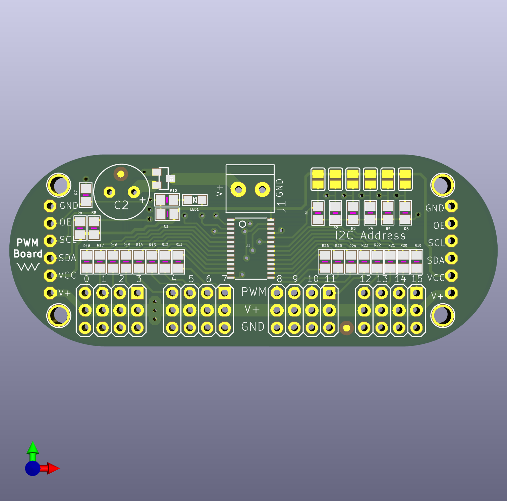
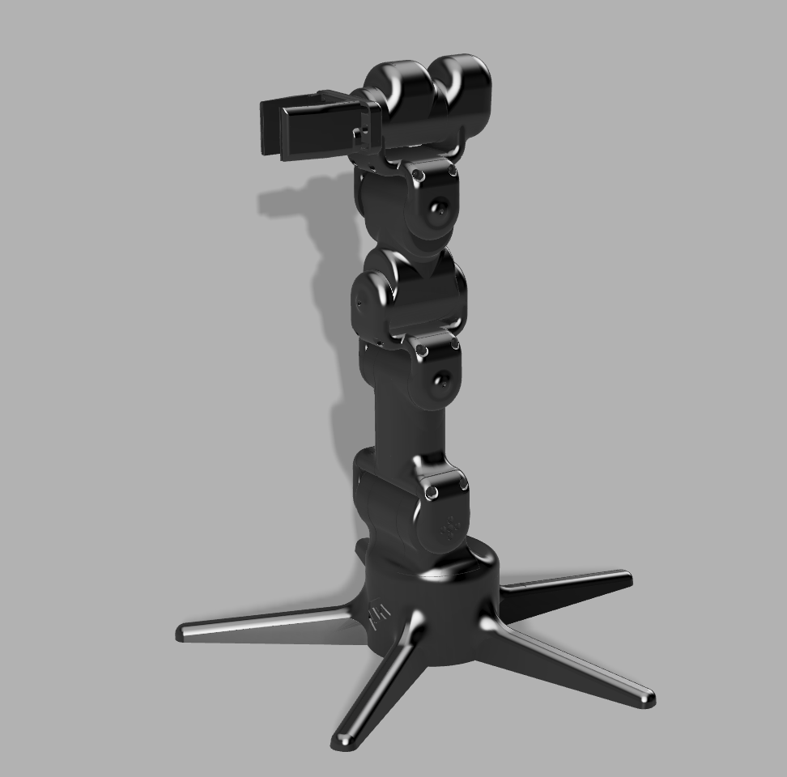

# Robotic Arm Project

A 3D-printed robotic arm, driven by an Arduino Uno R3 and a PCA9685 PWM
servo board, controlled through a live 3D interface in the browser.

The PCA9685 is a 16-channel PWM driver board built around Adafruit's
Arduino-based PWM servo driver design, controlled here by an Arduino Uno
R3. The Arduino doesn't drive the servos directly. It talks to the
PCA9685 over I2C, and the board generates all 16 PWM signals on its own.
This is what lets a single Arduino control far more servos than its own
pins could handle directly, without fighting timer conflicts.

The arm itself is 3D printed in PETG, using roughly 900g of filament for
the full model.

## Channel map and calibration

| Ch | Joint | Motion | Calibration center |
|----|-------|--------|---------------------|
| 0  | Base | Rotates parallel to the ground | 90, no fixed reference direction |
| 3 / 8 | Bottom hinge | Up/down, mirrored pair | 75 / 105 |
| 12 | 3rd hinge | Up/down | 90 |
| 7  | 2nd hinge | Bends left/right, perpendicular plane to the other hinges | 105 |
| 4  | Topmost hinge | Up/down | 90 |
| 15 | Grip rotation | Twists around the claw's own pointing axis | 60 |
| 11 | Grip | Open/close | 90, no fixed reference direction |

Ch3 and ch8 are mechanically mirrored, since they physically face each
other. Their raw angles always sum to 180. Both the Arduino sketch and
the control script derive one from the other so they can never drift
apart from rounding.

## How it works

`arm_final_control.ino` listens over serial for `channel:angle` commands
and applies each one immediately, with no internal ramping. Early on, the
sketch did ramp motion on its own, stepping one degree at a time with a
delay between steps. That caused a real bug: with the control side also
trying to smooth motion, the Arduino would be mid-delay and stop reading
incoming serial data, the buffer backed up, and the arm would freeze or
desync. Moving all smoothing to the control side and keeping the Arduino
a simple instant-write listener fixed it. The control side owns pacing,
the Arduino just executes, and that split is the architecture everything
downstream is built on.

The control side is a two-part local setup. A small Python bridge script
opens the actual serial connection to the Arduino and a local WebSocket
server. A browser page renders the arm in 3D using three.js and exposes a
slider per joint. Each joint rotates on its real physical axis. Up/down
hinges bend in one plane, the 2nd hinge bends in the perpendicular plane,
and the grip rotation twists around the claw's own pointing direction,
like a screwdriver bit, rather than around the arm's main axis.

Dragging a slider doesn't jump the arm straight to the new position.
Every joint has a target, wherever the slider currently is, and a current
value, what's actually been sent so far. A smoothing loop nudges the
current value a small step closer to the target roughly 50 times a
second. That's what keeps motion gradual, both from the browser
interaction and from any script that talks to the bridge.

Each slider's range is centered on that joint's own calibration value
instead of just running 0 to 180 for everything, and is capped to a
safety window. That means it's not possible to drag a joint into a
position closer to its mechanical limit than intended.

## Limitations of the current approach

- **Control is entirely manual.** Posing the arm means dragging sliders
  one at a time. There's no way to move several joints together with one
  gesture, and definitely no way to "reach for" a position the way a real
  arm would.
- **No feedback loop.** The system has no idea where the arm actually is
  beyond what it last commanded. If a servo stalls, gets physically
  blocked, or the arm is bumped, nothing detects or corrects for it.
- **No inverse kinematics.** Every joint is set independently by angle.
  There's no way to say "move the gripper to this point in space" and
  have the joints figure out how to get there together.
- **Slider control doesn't scale well to fast or complex motion.** It's
  fine for careful positioning, but clumsy for anything that needs to
  happen quickly across multiple joints at once.

## Currently working on

Exploring computer-vision-based control so the arm can mirror real arm
movement directly, rather than being posed joint by joint through
sliders. Two directions being evaluated: Google's MediaPipe pose and hand
tracking, and a marker-based tracking approach using printed fiducial
tags on the arm itself. Either would replace manual slider control with
live tracking of an actual human arm's position.
