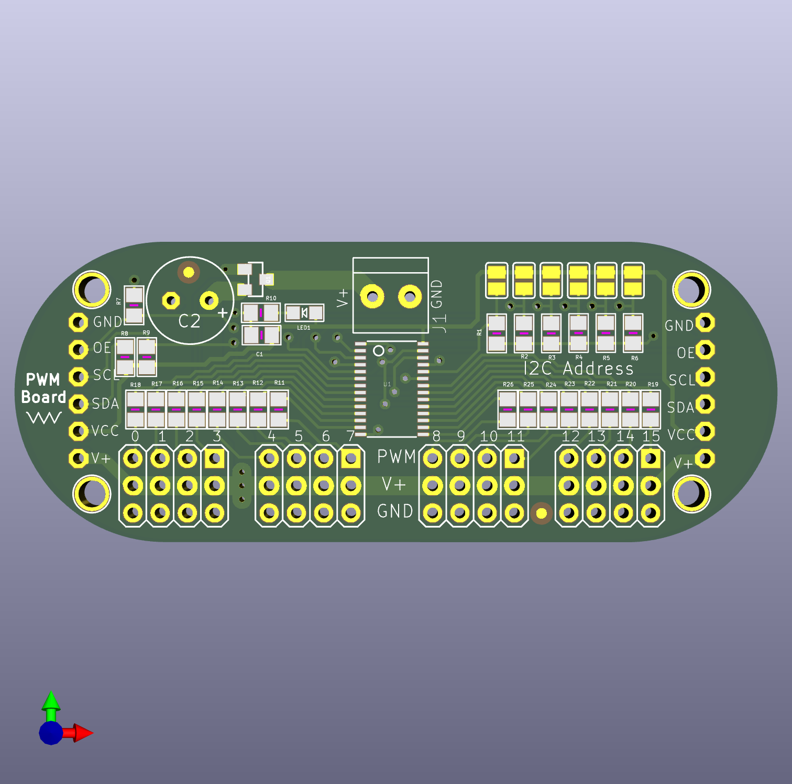
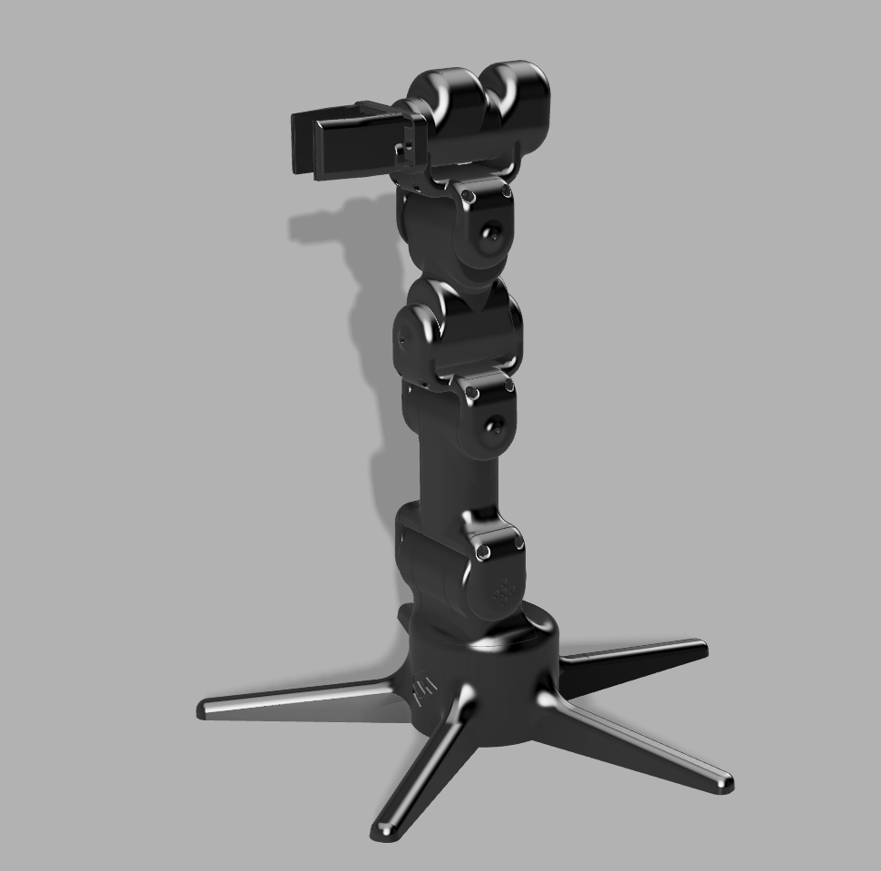
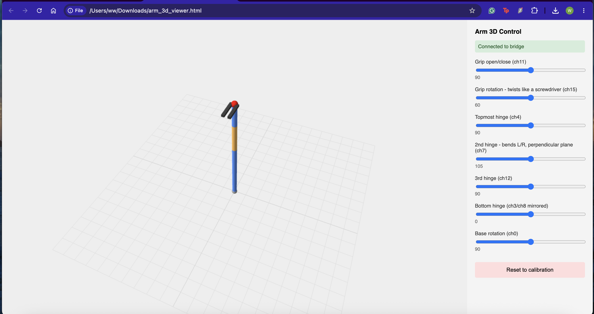

# Robotic Arm Project

A 3D-printed robotic arm, driven by an Arduino Uno R3 and a PCA9685 PWM
servo board, controlled through a live 3D interface in the browser.



The PCA9685 is a 16-channel PWM driver board built around Adafruit's
Arduino-based PWM servo driver design, controlled here by an Arduino Uno
R3. The Arduino doesn't drive the servos directly. It talks to the
PCA9685 over I2C, and the board generates all 16 PWM signals on its own.
This is what lets a single Arduino control far more servos than its own
pins could handle directly, without fighting timer conflicts.



The arm itself is 3D printed in PETG, using roughly 900g of filament for
the full model.

## Channel map and calibration

| Ch | Joint | Motion | Calibration center |
|----|-------|--------|---------------------|
| 0  | Base | Rotates parallel to the ground | 90, no fixed reference direction |
| 3 / 8 | Bottom hinge | Up/down, mirrored pair | 75 / 105 |
| 12 | 3rd hinge | Up/down | 90 |
| 7  | 2nd hinge | Bends left/right, perpendicular plane to the other hinges | 105 |
| 4  | Topmost hinge | Up/down | 90 |
| 15 | Grip rotation | Twists around the claw's own pointing axis | 60 |
| 11 | Grip | Open/close | 90, no fixed reference direction |

Ch3 and ch8 are mechanically mirrored, since they physically face each
other. Their raw angles always sum to 180. Both the Arduino sketch and
the control script derive one from the other so they can never drift
apart from rounding.

## How it works

`arm_final_control.ino` listens over serial for `channel:angle` commands
and applies each one immediately, with no internal ramping. Early on, the
sketch did ramp motion on its own, stepping one degree at a time with a
delay between steps. That caused a real bug: with the control side also
trying to smooth motion, the Arduino would be mid-delay and stop reading
incoming serial data, the buffer backed up, and the arm would freeze or
desync. Moving all smoothing to the control side and keeping the Arduino
a simple instant-write listener fixed it. The control side owns pacing,
the Arduino just executes, and that split is the architecture everything
downstream is built on.

The control side is a two-part local setup. A small Python bridge script
opens the actual serial connection to the Arduino and a local WebSocket
server. A browser page renders the arm in 3D using three.js and exposes a
slider per joint. Each joint rotates on its real physical axis. Up/down
hinges bend in one plane, the 2nd hinge bends in the perpendicular plane,
and the grip rotation twists around the claw's own pointing direction,
like a screwdriver bit, rather than around the arm's main axis.



Dragging a slider doesn't jump the arm straight to the new position.
Every joint has a target, wherever the slider currently is, and a current
value, what's actually been sent so far. A smoothing loop nudges the
current value a small step closer to the target roughly 50 times a
second. That's what keeps motion gradual, both from the browser
interaction and from any script that talks to the bridge.

Each slider's range is centered on that joint's own calibration value
instead of just running 0 to 180 for everything, and is capped to a
safety window. That means it's not possible to drag a joint into a
position closer to its mechanical limit than intended.

There's a second control page, `arm_gamepad_control.html`, that connects
to the same bridge and drives the arm with a PS5 DualSense controller
instead of sliders. The left stick handles base rotation and the bottom
hinge, the right stick handles the 2nd and 3rd hinge, the triggers handle
the topmost hinge, the bumpers handle grip rotation, and the face buttons
open and close the grip. This is velocity control, not position control.
Holding a stick or trigger moves the joint at a constant rate for as long
as it's held, rather than mapping stick position directly to arm
position. Every joint still respects the same calibrated safety range as
the sliders, so holding an input at the edge of its range just holds the
joint there instead of continuing to push against the limit.

## Limitations of the current approach

- **Control is entirely manual.** Posing the arm means dragging sliders
  one at a time. There's no way to move several joints together with one
  gesture, and definitely no way to "reach for" a position the way a real
  arm would.
- **No feedback loop.** The system has no idea where the arm actually is
  beyond what it last commanded. If a servo stalls, gets physically
  blocked, or the arm is bumped, nothing detects or corrects for it.
- **No inverse kinematics.** Every joint is set independently by angle.
  There's no way to say "move the gripper to this point in space" and
  have the joints figure out how to get there together.
- **Slider control doesn't scale well to fast or complex motion.** It's
  fine for careful positioning, but clumsy for anything that needs to
  happen quickly across multiple joints at once.

## Limitations of gamepad control

- **Stick drift.** Analog sticks often don't rest at exactly zero on
  every axis, and that resting bias can be enough to register as
  unintended input on its own. The gamepad page has a calibration button
  that measures each axis's true resting position and uses that as zero
  instead of assuming it's perfectly centered.
- **Cross-talk during a push, which calibration can't fix.** Calibration
  only measures the stick at rest. Pushing a stick in a straight line
  along one axis can still leak a small signal into the other axis on
  some hardware, this showed up as pushing straight down also triggering
  a small rotation. The fix in place compares both axes on a stick each
  frame and suppresses the smaller one whenever one axis is clearly
  dominant, so single-axis pushes read as single-axis input. Genuine
  diagonal pushes, where both axes are deliberately similar in magnitude,
  still pass through normally.
- **Calibration doesn't persist.** Stick calibration resets every time
  the page is reloaded and has to be redone each session.
- **Button and axis index mapping can vary between controllers and
  browsers.** The standard layout assumed here, for example buttons 6 and
  7 for the triggers, is common but not guaranteed. A different
  controller or browser may need the index numbers adjusted.
- **The Gamepad API only recognizes a controller per browser tab, and
  only after a real button press while that tab is focused.** Pairing a
  controller over Bluetooth, or detecting it on another page, doesn't
  carry over automatically. Each new tab needs its own button press to
  register the controller.

## Currently working on

Exploring computer-vision-based control so the arm can mirror real arm
movement directly, rather than being posed joint by joint through
sliders. Two directions being evaluated: Google's MediaPipe pose and hand
tracking, and a marker-based tracking approach using printed fiducial
tags on the arm itself. Either would replace manual slider control with
live tracking of an actual human arm's position.

Both approaches run into the same core issue: a single camera struggles
to reliably measure rotation around certain axes. Bending a joint up and
down, toward or away from the camera, is easy to see. Twisting a joint,
like forearm rotation or wrist twist, is much harder, since a monocular
camera has no real depth information and the visual cue for "this segment
just rotated along its own length" is subtle. Certain angles are
genuinely difficult to achieve reliably this way, particularly when a
tracked segment is edge-on to the camera or briefly occluded by another
part of the arm or hand. Marker-based tracking helps with the flexion and
extension angles, but rotation still needs either a better camera angle,
multiple markers per segment to catch whichever one is currently facing
the camera, or a fallback like an IMU for the axes vision alone can't
resolve well.

## Development environment

This was built and run on macOS. Every Python script here expects to run
inside a virtual environment rather than the system Python, both to keep
dependencies isolated and because macOS's built-in Python has caused
real problems in this project, including a broken Tk installation that
crashed the GUI outright until a separate Python install was used
instead. Setup looks like this:

```bash
python3 -m venv arm_env
source arm_env/bin/activate
pip install pyserial opencv-contrib-python numpy websockets
```

The virtual environment needs to be activated in any new terminal window
before running a script. Only one program can hold the Arduino's serial
port open at a time, so the Arduino IDE's Serial Monitor has to be closed
before running anything here.
